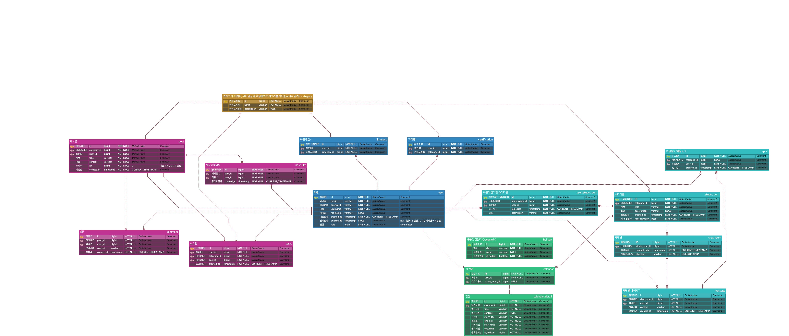

# meetstudy Backend

<br />
<div align="center">
  
</div>


## meetStudy v1.0

> **엘리스 클라우드 트랙 2기 - 9팀**  
> **개발기간** : 2024.05.20 ~ 2024.06.14(4주)


### 배포 주소

---
> **백엔드 서버** : ~~<http://34.47.79.59:8080/>~~  
> **swagger** : ~~<http://34.47.79.59:8080/swagger-ui/index.html#/>~~


<br/>


### A . 개발팀

---
<div  align="center" text-align="center" style="text-align: center">


|  |  |  |  |  |  |
|-----------------------------------------------|-----------------------------------------------|-----------------------------------------------|-----------------------------------------------|-----------------------------------------------|------------------------------------------|
| 이하영⭐                                          | 이형룡                                           | 김민상                                           | 강서연                                           | 황예준                                           | 윤수민                                      |
| -                                             | -                             | -  | -  | -   | [@suuuuo](https://github.com/suuuuo)                              |
| 맡은 부분                                         | 맡은 부분                                         | 맡은 부분                                         | 맡은 부분                                         | 맡은 부분                                         | 캘린더, QnA                                 |

</div>
<br />

### B. 프로젝트 소개

---

<br/>

<div align="center">


</div>

<div align="center">


엘리스 클라우드 트랙은 클라우드 기반 백엔드 엔지니어가 되기 위한 24주간의 훈련 과정입니다.


본 프로젝트는 마지막 4주간 진행된 최종 프로젝트로,  
공통 관심사를 가진 이들과 소통하며 효과적으로 자기계발을 이어나가길 원하는 사람들을 위해 만들어졌습니다.

이 서비스의 온라인 스터디룸은 방에 소속된 회원들이 참여할 수 있는 채팅방과 공동 캘린더를 제공하여  
회원들이 소통과 일정 관리를 한 곳에서 할 수 있도록 돕습니다.  
또한, 다양한 주제에 대해 활발히 토론하고 정보를 나눌 수 있는 커뮤니티 기능도 포함하고 있습니다.


</div>

<br />
<br />


ref.
- 참고 자료 목록
    - ERD
  <div align="center">
  
</div>


<br />

### C. 시작 가이드

---
**Requirements**

For building and running the application you need:


<br />

**Installation**

> $ git clone https://kdt-gitlab.elice.io/cloud_track/class_02/web_project3/team09/meetstudy.git  
> $ cd meetstudy

<br />

<br />

### D. Stacks

---


**Environment**  


**Development**  


**Communication**  


<br />


### E. 주요 기능

---


### ✏️정렬 순서에 관심사 반영

- 회원가입 시 관심사 선택, 해당 관심사에 맞는 스터디룸 우선 정렬


### ✏️다수의 사람이 동시에 채팅방 이용 가능

- 각 스터디룸마다 채팅방 생성/이용 가능


### ✏️캘린더 제공

- 스터디룸/개인마다 캘린더(공휴일 정보 포함) 이용 가능


<br />

### F. API 목록

---

본 프로젝트에서 제공되는 API를 설명합니다.

이 섹션에서는 **각 도메인 별로 주요한 API** 만을 언급합니다.  
보다 상세한 CRUD API 정보는 Swagger를 통해 문서화되어 제공되며, ~~[여기](http://34.47.79.59:8080/swagger-ui/index.html#)~~ 에서 확인할 수 있습니다.

도메인 이름 우측 링크를 통해 노션으로 작성된 API 명세서가 제공됩니다.

<br />

**인증 및 권한**
- 회원가입과 로그인을 제외한 모든 기능은 **회원에게만** 제공됩니다.
- API 호출 시 'Bearer Token' 인증을 요구합니다.

<br />

[//]: # (**에러 코드**)

[//]: # (- 에러 코드 정리 표)

<br />
<br />


**유저(user)**

- **GET** `/api/user/join` : 회원가입
- **POST** `/api/user/mailSend` : 회원가입 - 이메일 인증 메일 발송
- **POST** `/api/user/findPassword` : 비밀번호 찾기

<br />

**관리자(admin)**
- **GET** `/api/admin/users` : 모든 회원 조회
- **GET** `/api/admin/comments/search` : 전체 댓글 내 키워드 검색
- **DELETE** `/api/admin/users/{id}` : 회원 삭제

<br />


**카테고리(category)**
- **GET** `/api/admin/categories/public` : 모든 카테고리 조회
- **POST** `/api/admin/categories` : 카테고리 생성
- **DELETE** `/api/admin/categories/{id}` : 카테고리 삭제

<br />


**커뮤니티(post)**
- **GET** `/api/post/public/search` : 전체 게시판 내 게시글 키워드 검색
- **POST** `/api/post/{postId}/like` : 게시글 좋아요
- **PATCH** `/api/post/{postId}` : 게시글 수정

<br />

**스크랩(scrap)**
- **DELETE** `/api/admin/users/{id}` : 회원 삭
- **DELETE** `/api/admin/users/{id}` : 회원 삭제
- **DELETE** `/api/admin/users/{id}` : 회원 삭제

<br />


**스터디룸(studyroom)**
- **GET** `/api/scrap/category` : 게시판 즐겨찾기 목록 조회
- **POST** `/api/scrap/category/{categoryId}` : 게시판 즐겨찾기
- **POST** `/api/scrap/{postId}` : 게시글 스크랩
  <br />


**채팅(chatroom)**
- **POST** `/api/chatroom/add` : 채팅방 생성
- **PUT** `/api/chatroom/chatAdmin` : 채팅방 방장 변경
- **PUT** `/api/chatroom/notice` : 채팅방 공지사항 수정

<br />


**캘린더(calendar) - [API 명세서](노션 링크)**
- **GET** `/api/calendar` : 개인 캘린더 조회
- **GET** `/api/calendar/{studyRoomId}` : 스터디룸 공용 캘린더 조회
- **POST** `/api/calendar `: 개인 캘린더에 일정 추가


<br />


**문의(qna) - [API 명세서](노션 링크)**
- **GET** `/api/question/public`:  페이징, 카테고리, 키워드에 따라 문의 목록 조회
- **POST** `/api/question` : 문의 생성

  <br />


### G. 아키텍처

---

**개요**
- **Controller**: HTTP 요청을 처리하고 서비스를 호출합니다.
- **Service**: 비즈니스 로직을 구현합니다.
- **Repository**: 데이터베이스와 상호작용합니다.
- **entity/domain**: 데이터베이스 엔티티와 도메인 모델을 정의합니다.
- **Config**: 애플리케이션 설정과 구성 요소를 정의합니다.

<br />


**디렉토리 구조**

```text
main  
  └─java.com.elice  
          └─meetstudy  
              ├─config  
              ├─domain  
              │  ├─admin  
              │  │   ├─controller  
              │  │   └─service
              │  ├─audit : BaseEntity, BaseTimeEntity
              │  ├─calendar
              │  │  ├─controller
              │  │  ├─holiday : 공휴일 open api 처리
              │  │  │  ├─controller
              │  │  │  :
              │  │  :  └─service
              │  │  └─service
              │  ├─category
              │  │  ├─controller
              │  │  ├─dto
              │  │  ├─entity
              │  │  ├─repository
              │  │  └─service
              │  ├─chatroom
              │  │  ├─controller
              │  │  ├─domain
              │  │  ├─dto
              │  │  ├─handler
              │  │  ├─repository
              │  │  └─service
              │  ├─comment
              │  │  ├─controller
              │  │  ├─domain
              │  │  ├─dto
              │  │  ├─repository
              │  │  └─service
              │  ├─post
              │  │  ├─controller
              │  │  ├─domain
              │  │  ├─dto
              │  │  ├─repository
              │  │  └─service
              │  ├─qna
              │  │  ├─controller
              │  │  :
              │  │  ├─exception : 커스텀 validator / 예외처리
              │  │  └─service
              │  ├─scrap
              │  │  ├─controller
              │  │  ├─domain
              │  │  ├─dto
              │  │  ├─repository
              │  │  └─service
              │  ├─studyroom
              │  │  ├─controller
              │  │  ├─DTO
              │  │  ├─entity
              │  │  ├─exception
              │  │  ├─mapper
              │  │  ├─repository
              │  │  └─service
              │  └─user
              │      ├─controller
              │      ├─domain
              │      ├─dto
              │      ├─jwt
              │      │  ├─token
              │      │  │  └─dto
              │      │  └─web
              │      │      ├─controller
              │      │      ├─filter
              │      │      └─json
              │      ├─mapper
              │      ├─repository
              │      ├─service
              │      └─util
              ├─test
              └─util

```
 


